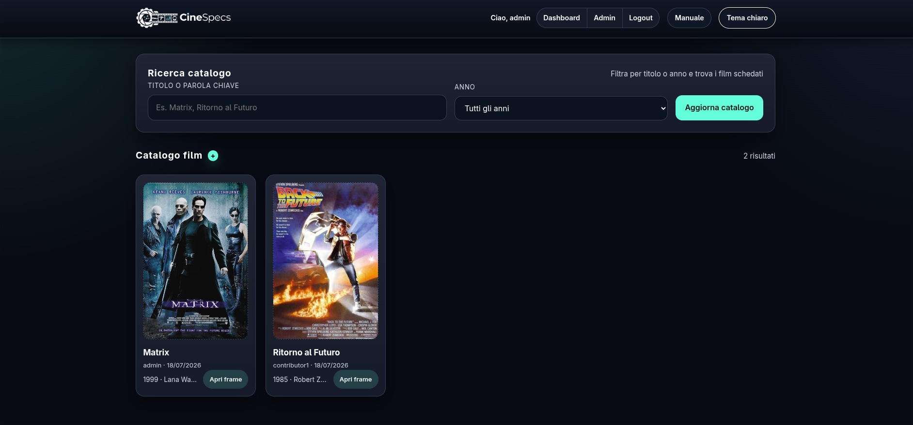
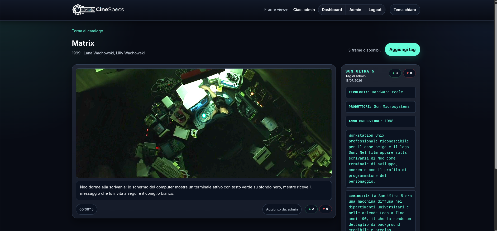
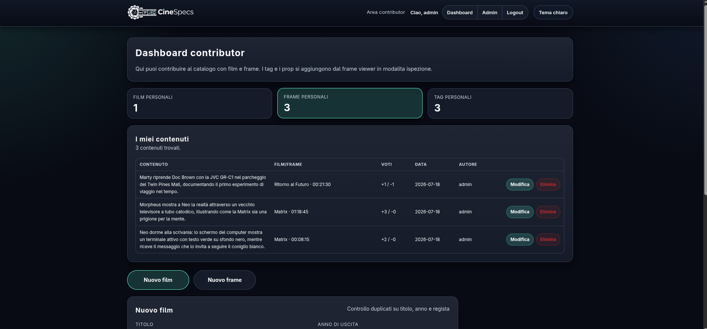

# CineSpecs

CineSpecs è un archivio interattivo che raccoglie informazioni sull'hardware reale o fittizio che compare nei film: computer, videocamere, dispositivi futuristici e molto altro. Chiunque può sfogliare il catalogo e scoprire che oggetto tecnologico viene mostrato in una scena, chi lo ha identificato e quanti utenti lo hanno apprezzato.

> **🎓 Info sull'Esame (Appello di Settembre 2026 - Prof. Vecchio e assistente):**
> 
> L'esame è andato così: all'inizio ci hanno fatto presentare il progetto e mostrare un po' le varie feature. Poi però si sono buttati subito sul codice JS e PHP, chiedendo nel dettaglio cosa facessero alcune righe specifiche, il *flow of events*, quale file gestisse una determinata logica e come passassimo le informazioni tra JavaScript e PHP.
> 
> Quando qualcuno non sapeva rispondere, viravano direttamente sulla teoria del corso (roba tipo i tipi di variabili in JS, differenze tra POST e GET, regex, ecc.). Alcuni ragazzi sono stati purtroppo rimandati al prossimo appello.
> 
> In generale, se si conosce decentemente il progetto e si riesce a navigare con sicurezza tra i file, non è una tragedia se non ci si ricorda esattamente cosa fa ogni singola riga. Al massimo ti abbassano un pochino il voto, ma si va avanti tranquilli. 
> Da appuntare che, a quanto si diceva in giro, negli appelli scorsi erano molto più tranquilli e facevano pochissime domande. A questo giro invece sono stati decisamente più pignoli.
>
> **Nota sull'AI:** Per scrivere il codice di questo progetto ho usato pesantemente l'Intelligenza Artificiale. Però attenzione: è **imperativo** conoscere il codice prima di presentarlo, saper spiegare le scelte di design e non farsi trovare spaesati tra i file.

## Feature del Progetto

Il progetto offre le seguenti funzionalità principali:

### 1. Catalogo e Ricerca
Nella pagina principale è visibile l'elenco dei film presenti nell'archivio. È possibile filtrare i risultati in modo dinamico digitando il titolo del film o scegliendo l'anno di uscita dal menu.

### 2. Il Frame Viewer e i Pulse-Tag
Cliccando su un film, si accede al visualizzatore di fotogrammi (Viewer). Sui fotogrammi sono presenti dei marcatori interattivi chiamati **Pulse-Tag** che indicano un oggetto tecnologico visibile nella scena. 
Cliccando su un tag, si apre la scheda dell'oggetto con nome, produttore, anno e curiosità. È integrato un sistema di rating per votare i tag (upvote/downvote). In basso è presente una timeline per scorrere rapidamente i frame.

### 3. Contributi e Dashboard Personale
Gli utenti registrati possono contribuire attivamente all'archivio. Dalla propria dashboard, un utente può inserire nuovi film, aggiungere fotogrammi caricando immagini e, tramite il Viewer, inserire nuovi **Pulse-Tag** semplicemente cliccando sul punto esatto dell'immagine.

### 4. Pannello Amministratore
È presente un pannello di moderazione riservato agli admin, che permette di visionare e, se necessario, rimuovere film, fotogrammi o tag caricati da qualsiasi utente, garantendo il controllo sulla qualità dei contenuti.

## Dettagli Tecnici (Utili per l'esame)

Per chi dovrà sostenere l'esame, ecco una rapida panoramica su come è strutturato il codice sotto il cofano, con alcuni "hot-topics" molto gettonati dai professori:

- **Stack Tecnologico:** Il progetto è sviluppato in **Vanilla PHP** per il backend e **Vanilla JavaScript** per il frontend (niente framework come React o Laravel). Il database è in **MySQL**.
- **Architettura e API:** C'è una netta separazione tra i file che renderizzano l'interfaccia (come `dashboard.php` o `frame_viewer.php`) e gli endpoint che gestiscono i dati. Nella cartella `php/` troverete script dedicati come `api_crud.php`, `api_get_tags.php` e `api_vote.php`.
- **Comunicazione Asincrona (AJAX):** JavaScript comunica con PHP in modo asincrono utilizzando la **Fetch API**. Ad esempio, nel file `js/viewer.js`, i dati dei *Pulse-Tag* e i voti vengono inviati e ricevuti tramite chiamate `fetch` (metodi GET per recuperare i tag, POST per votare o aggiungere tag). All'esame i prof sottolineano molto la presenza di chiamate asincrone, quindi studiatevi bene come avviene questo passaggio di dati tra JS e l'endpoint PHP che in questo progetto risponde con un JSON (tramite l'helper custom `send_json`).
- **Sicurezza (SQL Injection e XSS):** 
  - *SQL Injection*: Nel file `php/config.php` è presente un custom helper `db_query()` che sfrutta i **Prepared Statements di PDO** per parametrizzare tutte le query in modo sicuro al 100%, impedendo attacchi sul database.
  - *XSS (Cross-Site Scripting)*: Tutto ciò che viene stampato a schermo dal server è sanitizzato con `htmlspecialchars($var, ENT_QUOTES, 'UTF-8')`. Per le chiamate asincrone, JS inietta i dati manipolando il DOM in sicurezza o usando `textContent`. I prof chiedono *spessissimo* come viene gestita la sicurezza, soprattutto negli accessi asincroni!
- **Feature Interessante (Pulse-Tags a Percentuale):** Le "chicca" del progetto che cattura facilmente l'occhio (sulle feature interesssanti potrebbero chiedervi di localizzare la funzione e farne un teardown lì per lì) è il posizionamento dei tag. Quando un utente clicca sull'immagine nel Viewer, le coordinate vengono convertite e salvate nel database come **percentuali** (`coord_x` e `coord_y`). Nel file `js/viewer.js` queste percentuali vengono applicate come `style.left` e `style.top`. Questo rende i tag completamente *responsive* e corretti a qualsiasi risoluzione o dimensione dello schermo
- **Validazione:** La validazione dei form avviene sempre sia lato client (tramite JS in `js/validation.js`) sia lato server (in PHP), per garantire maggiore solidità. Le famose *regex* vengono ampiamente usate per validare formati come i timestamp.
- **Gestione dello Stato e Sessioni:** Il login, l'autenticazione e i ruoli (admin vs contributor) sono gestiti tramite le classiche variabili `$_SESSION` di PHP (es. `auth.php`).
